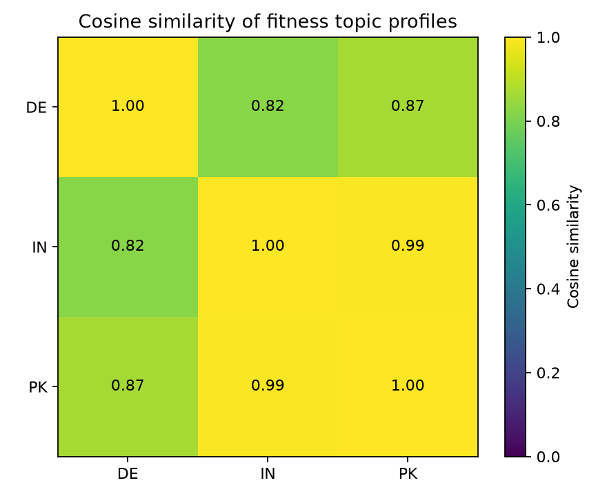

# Global Fitness Convergence?

**跨国健身内容的量化比较** · A quantitative comparison of fitness themes in trending videos across countries.

本项目研究一个难以直接测量的问题：不同国家流行的健身内容是否具有相似的主题结构？分析将视频标题中的健身内容归纳为 **训练、体态、营养、身心健康** 四个可重叠的维度，以各主题在本国健身视频中的出现比例构成国家向量，再用余弦相似度比较国家之间的主题分布，并通过自助重采样检查结果对样本变动的敏感程度。

> **研究范围**：仓库中的结果来自德国、印度、巴基斯坦共 36 条**合成示例视频**，用于演示和验证分析流程。它们不能证明现实中的健身文化已经趋同。当前实现比较的是一个静态样本，没有估计随时间变化的趋同趋势，也没有使用健康统计或消费数据。

## 研究流程

1. **整理数据**：识别不同命名的标题、国家、观看量、点赞量、评论量等字段，清除无效值和重复记录。
2. **构建指标**：按标题关键词给视频标记训练（workout）、体态（body）、营养（nutrition）、身心健康（wellness）主题；一条视频可属于多个主题。
3. **表示国家**：计算每个国家的健身相关视频占比，以及四维主题向量。向量分量是各主题在本国健身视频中的出现比例，因此不要求相加为 1。
4. **比较与验证**：计算国家向量之间的余弦相似度，并在各国内对健身视频进行 300 次自助重采样，报告相似度的经验区间。
5. **探索互动量**：以各国互动率中位数为界，建立一个逻辑回归模型，探索国家与标题特征能否预测相对较高的互动量。

## 示例结果

| 国家组合 | 主题向量余弦相似度 | 重采样均值 | 95% 经验区间 |
| --- | ---: | ---: | ---: |
| 印度–巴基斯坦 | 0.994 | 0.828 | [0.465, 0.979] |
| 德国–巴基斯坦 | 0.867 | 0.714 | [0.269, 0.981] |
| 德国–印度 | 0.823 | 0.686 | [0.263, 0.979] |

三个国家各有 12 条示例视频，其中各有 9 条被关键词规则标为健身相关。点估计显示印度与巴基斯坦的主题向量最接近，但重采样区间宽且相互重叠，应谨慎解释排序。探索性互动模型在 11 条测试记录上的准确率为 0.636，平衡准确率为 0.667，ROC–AUC 为 0.633；该小样本实验不支持强预测或因果结论。详细方法、图表和解释见 [研究报告](Report_Fitness.pdf)。



## 仓库内容

| 路径 | 内容 |
| --- | --- |
| [`fitness_convergence.ipynb`](fitness_convergence.ipynb) | 从示例数据到图表的完整交互式分析 |
| [`src/`](src/) | 字段验证、预处理、主题表示、相似度、模型与可视化函数 |
| [`data/sample/mini_fixture.csv`](data/sample/mini_fixture.csv) | 36 条合成示例记录 |
| [`data/processed/`](data/processed/) | 示例运行生成的整理后数据与国家指标 |
| [`results/`](results/) | 示例指标、重采样结果与图表 |
| [`Report_Fitness.pdf`](Report_Fitness.pdf) | 完整英文研究报告 |

## 运行

需要 Python 3.10+、Jupyter Notebook 或兼容的笔记本环境。

```bash
python -m pip install -r requirements.txt
python -m pip install jupyterlab
jupyter lab fitness_convergence.ipynb
```

从仓库根目录运行笔记本，按顺序执行单元。默认 `USE_PUBLIC_DATA = False`，使用仓库内的合成示例数据。笔记本会写入 `data/processed/` 和 `results/`。若改用外部数据，需先核对字段、国家含义、采样时间、平台覆盖范围与数据使用许可；`src/config.py` 中的外部数据仓库地址仅提供一个待核验的数据入口。

## 解释边界与下一步

- 标题关键词衡量的是**网络内容的主题可见度**，不能直接代表真实锻炼行为、身体审美、健康消费或健康水平。
- 余弦相似度比较的是四类主题的相对结构，不表示两个国家的内容量、参与率或健康状况相同。
- 要回答“是否正在趋同”，需要有可比的跨期样本，在统一口径下比较各时间点的国家间距离，并用替代关键词、标准化方法与其他数据源检验稳定性。
- 若进一步研究健康消费或健康结果，应将其与网络内容指标分开建模，并在解释中明确两类指标的不同含义。

**English summary.** This project turns a qualitative question about fitness culture into four-dimensional country profiles based on trending-video titles. It compares profile direction with cosine similarity and uses bootstrap resampling to show sampling uncertainty. The included synthetic fixture demonstrates the workflow; it does not establish real-world or time-series convergence.
